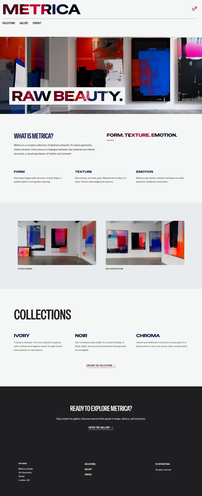

# Metrica

**Raw / Beauty by Design**

Metrica is an e-commerce site for abstract artwork, blending geometric structure with emotional depth. Each piece layers bold form over raw textures. Built with Next.js, Tailwind, Sanity, and Snipcart. Metrica offers a refined, gallery-like shopping experience.

## 🧱 Built With

  
  
  
  

[Next.js](https://nextjs.org/) – React Framework for fast static and server-rendered sites.
[Tailwind CSS](https://tailwindcss.com/) – Utility-first styling for responsive design.
[Sanity](https://www.sanity.io/) – Headless CMS for structured content.
[Snipcart](https://snipcart.com/) – For shopping cart integration.

  

## 🚀 Features

* **Swiss-Inspired Design:** Geometric layouts, bold typography, and a minimalist colour system
* **Collection-Based Gallery:** Artworks organised by curated themes
* **Snipcart Integration:** Seamless cart experience with simple setup
* **Fully Responsive:** Clean and elegant across all screen sizes
* **CMS-Driven Content:** Sanity integration for easy updates and scalability

## 🔗 Link to Deployed Site

👉 [https://metrica-one.vercel.app/](https://metrica-one.vercel.app/)